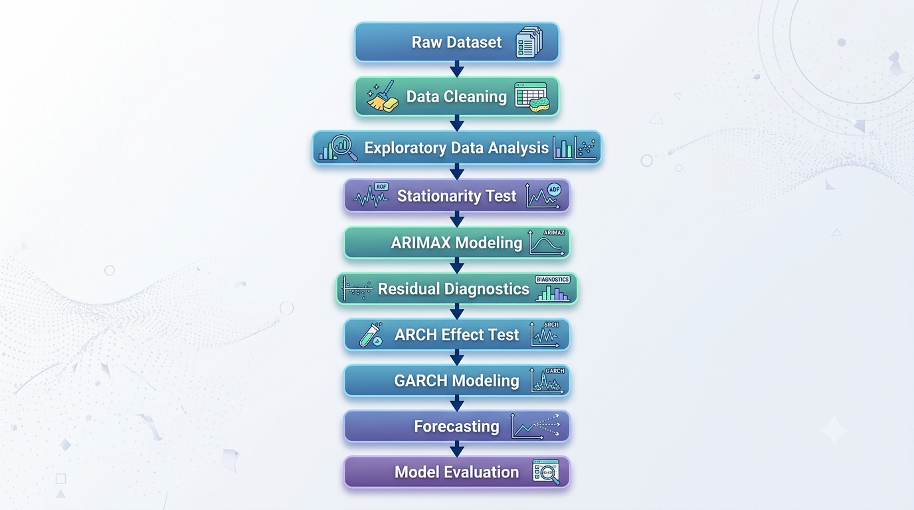
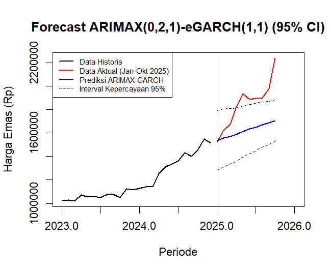

## 📖 Project Overview
This project develops a hybrid **ARIMAX-eGARCH** model to forecast monthly gold prices using historical data from 2014 to 2025.
The forecasting model incorporates inflation and the USD/IDR exchange rate as exogenous variables to improve prediction accuracy, while the eGARCH model captures volatility clustering commonly observed in financial time series.
The project demonstrates an end-to-end forecasting workflow, including data preprocessing, stationarity testing, ARIMAX modeling, volatility modeling, forecasting, and model evaluation.

## ✨ Project Highlight
- Developed a hybrid ARIMAX-eGARCH model for monthly gold price forecasting.
- Incorporated inflation and USD/IDR exchange rate as exogenous variables.
- Compared multiple ARIMAX and GARCH candidate models.
- Evaluated forecasting performance using RMSE, MAD, and MAPE.
- Built a reproducible forecasting workflow in R.

## 🔄 Project Workflow
The following workflow illustrates the complete process of developing the ARIMAX-GARCH forecasting model.

  

## 📈 Forecast Result

The hybrid ARIMAX(0,2,1)-eGARCH(1,1) model was used to forecast monthly gold prices with a 95% confidence interval.

  

## 📂 Dataset
The dataset contains monthly observations from **January 2014 to October 2025**, including:
- Gold Opening Price (https://www.logammulia.com/id/harga-emas-hari-ini)
- Inflation Rate (https://www.bi.go.id/id/statistik/indikator/data-inflasi.aspx)
- USD/IDR Exchange Rate (https://satudata.kemendag.go.id/data-informasi/perdagangan-dalam-negeri/nilai-tukar)

The dataset was prepared and cleaned before the modeling process.

## 🚀 How to Run
1. Clone this repository.
2. Place the dataset in the `data` folder.
3. Open the R scripts in RStudio.
4. Run the scripts sequentially:
   - 01_data_preparation.R
   - 02_exploratory_data_analysis.R
   - 03_stationarity_test.R
   - 04_arimax_modeling.R
   - 05_garch_modeling.R
   - 06_forecasting.R
   - 07_model_evaluation.R
