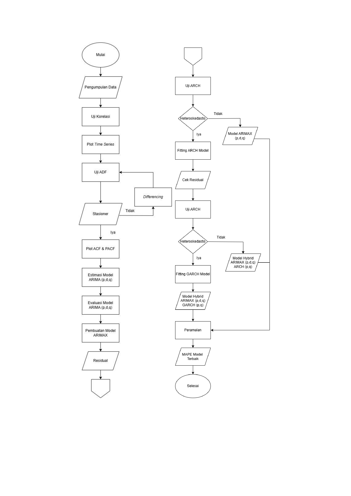

# Project Highlight
- Developed a hybrid ARIMAX-eGARCH model for monthly gold price forecasting.
- Incorporated inflation and USD/IDR exchange rate as exogenous variables.
- Compared multiple ARIMAX and GARCH candidate models.
- Evaluated forecasting performance using RMSE, MAD, and MAPE.
- Built a reproducible forecasting workflow in R.

## 🔄 Project Workflow
The following workflow illustrates the complete process of developing the ARIMAX-GARCH forecasting model.

  

## 📈 Forecast Result

The hybrid ARIMAX(0,2,1)-eGARCH(1,1) model was used to forecast monthly gold prices with a 95% confidence interval.

  

